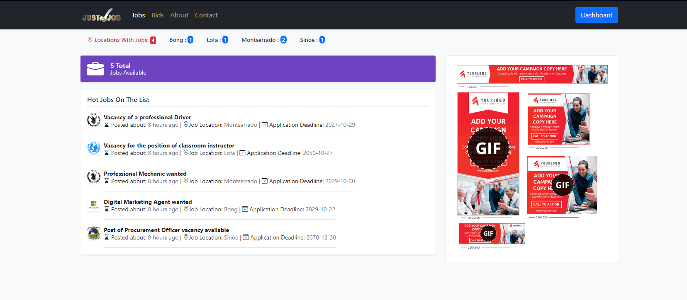

# Joblister Fullstack Website (CodeIgniter 4)

## Overview

Welcome to Joblister, a fullstack web application built on CodeIgniter 4, enabling administrators to post jobs and bids effortlessly. This application is designed to streamline the process of job listing and bidding, with robust CRUD (Create, Read, Update, Delete) operations for both jobs and bids. Additionally, administrators can efficiently manage users.

## Features

1. **Job Posting:**
   - Admins can post job listings with detailed information, including title, description, requirements, and deadline.
   - Each job listing is timestamped to track when it was posted.

2. **Bid Management:**
   - Admins can manage bids associated with each job.
   - View and evaluate bids based on relevant details such as bid amount, bidder information, and timestamp.

3. **User Management:**
   - Admins have the ability to add, view, update, and remove users.
   - User management ensures secure access to the application and controls who can post jobs, bids, or perform administrative tasks.

4. **CRUD Operations:**
   - Comprehensive CRUD operations for both jobs and bids.
   - Admins can create, read, update, and delete job listings and bids to maintain accurate and up-to-date information.

## Tech Stack

- **Backend (CodeIgniter 4):**
  - PHP
  - CodeIgniter 4 framework for server-side logic
  - MySQL or any preferred database for data storage

- **Frontend:**
  - HTML5, CSS3, JavaScript

- **Authentication:**
  - Implement CodeIgniter's authentication system or integrate with a secure authentication library.

## Setup Instructions

1. **Clone the Repository:**
   ```
   git clone https://github.com/seaniaborbor/joblister.git
   cd joblister-ci4
   ```

2. **Install Dependencies:**
   ```
   composer install
   ```

3. **Configure Database:**
   - Create a new MySQL database name justthejob and inport sql file in the root directory of the clone project.
   - Configure the database connection in `app/config/database.php`.

4. **Run Migrations:**
   ```
   php spark migrate
   ```

5. **Seed Database (Optional):**
   - Optionally, run seeders to populate the database with sample data.
   ```
   php spark db:seed
   ```

6. **Run the Application:**
   - Start the development server.
   ```
   php spark serve
   ```

7. **Access the Application:**
   - Open your browser and navigate to `http://localhost:8080`

## Usage

1. **Login as Admin:**
   - Use the admin credentials to log in and access the admin dashboard.
   - Login details/credentials: testuse@gmail.com; 12345678 are the email and password respectively

2. **Manage Jobs:**
   - Add, edit, and delete job listings.

3. **Manage Bids:**
   - View, evaluate, and manage bids associated with each job.

4. **User Management:**
   - Add, view, edit, and remove users.

## Contributions

Contributions are welcome! If you find any issues or have suggestions for improvements, feel free to create a pull request.

## License

This project is licensed under the MIT License - see the [LICENSE](LICENSE) file for details.